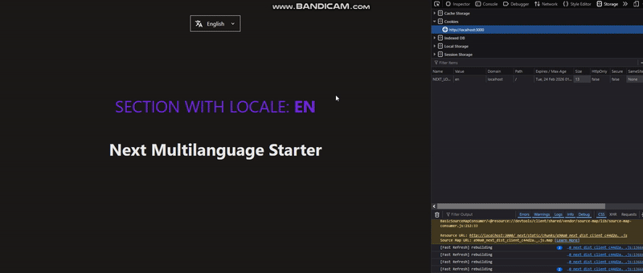

# Next Multi Language Starter


## Demo




This is a [Next.js](https://nextjs.org) project bootstrapped with [`create-next-app`](https://nextjs.org/docs/app/api-reference/cli/create-next-app).

## Features

- **Next.js 15** – Leverages the latest Next.js features for optimal performance.
- **Internationalization (i18n)** – Supports multiple languages with easy configuration.
- **Locale Management in Cookies** – Stores and retrieves user locale preferences via cookies.
- **App Router** – Uses the latest Next.js app directory for modern routing.
- **ShadCN UI** – Styled components for fast and clean UI development.
- **TypeScript** – Fully typed codebase for better developer experience.
- **Base Section Component** – Implements dir attribute for proper text direction handling.
## Installation

Clone the repository and install dependencies:

```sh
git clone https://github.com/raul0073/next-starter-multilang.git
pnpm install  # or npm install / yarn install
```

## Running the Development Server

Start the local development server:

```sh
pnpm dev  # or npm run dev / yarn dev
```

Then, open [http://localhost:3000](http://localhost:3000) in your browser.

## Internationalization (i18n) Setup

This starter uses [next-intl](https://next-intl-docs.vercel.app/) for managing translations. Locale preferences are stored in cookies.

### Adding a New Language

1. Create a new JSON file inside `locales/` (e.g., `locales/es.json`).
2. Add your translations inside the file.
3. Update components -> 'LocaleSwitcher.tsx' to include the new language.

## Contributing

If you'd like to contribute, feel free to fork the repository and submit a pull request.

## License

This project is licensed under the MIT License.

